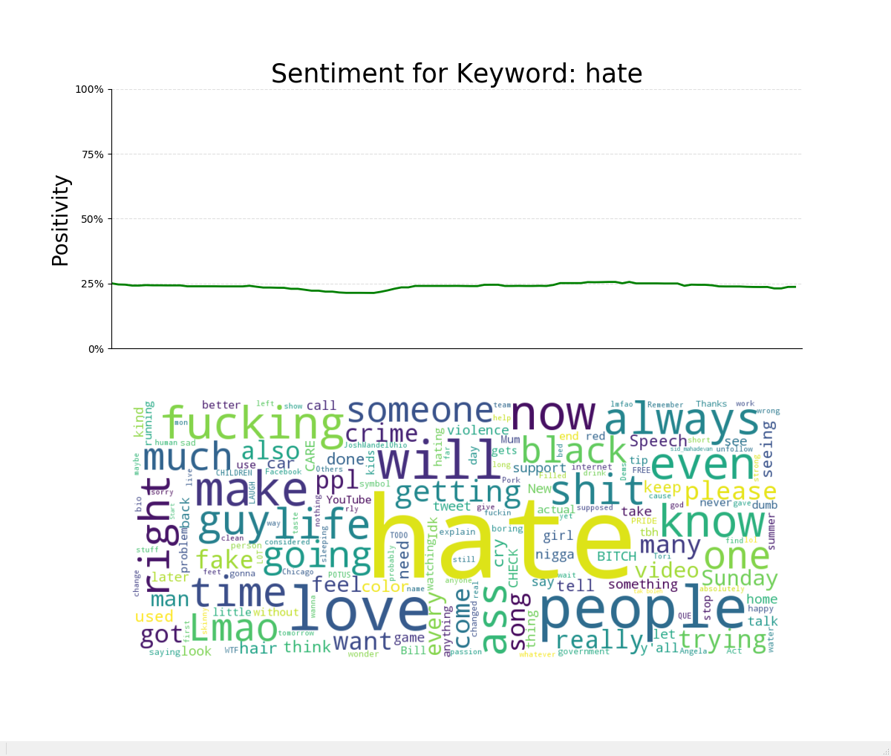

# LiveTwitterSentimentAnalysis
Live analysis of Twitter sentiment toward any given keyword.

This program takes a single keyword as input. It will then begin streaming tweets containing that keyword from Twitter, passing the tweets through a battery of machine learning classifiers to tag them as either positive or negative, then graphing the results, all in real time. The output is in the form of a running-average sentiment graph and a word cloud generated from the most recent tweets.

I had the idea for this program while I was watching E3 2017. As the companies were unveiling their new games, new technologies, new marketing campaigns and so forth, the audience would always applaud and cheer enthusiastically. The live audience, having been caught up in the glitz and glamor, swag and hype of E3, were not a reliable measure of the general reception of these new announcements. I wondered to myself, "How do people really feel about this stuff?" This program was created in an effort to answer that question.

## Usage

To use this program, simply run it like any other Python program:

```sh
python main.py
```

You will be prompted to enter a keyword to search for and analyze. After entering the keyword, the program will connect to Twitter and begin displaying the output.

## Installation

This program requires Python 3.6 or newer.

The required 3rd party modules are listed in requirements.txt and can be batch installed with the following command:

```sh
pip install -r requirements.txt
```

In order to set up a Twitter stream, Twitter's API 1.1 requires two Consumer Keys and two Access Tokens. These keys and tokens are not meant to be shared, and so they have not been provided. You will have to provide your own keys and tokens. To get a set of keys and tokens, follow these steps:

1. Go to https://apps.twitter.com/
2. Click "Create New App".
3. Input a Name, Description, and Website url. None of these things matter, you can just put in random garbage.
3. Click on the "Keys and Access Tokens" tab. Here you can see your Consumer Key and Consumer Secret.
4. At the bottom, click "create my access token". This gives you the Access Token and Access Token Secret.

Once you have the keys and tokens, copy and paste them into keys.txt. They should be in order, Consumer Key, Consumer Secret, Access Token, Access Token Secret, with one key/token per line.


This repository also contains pickle files. These pickles contain pre-trained machine learning classifiers, and using the pickles allows the program to start up very quickly. If you do not want to use the provided pickles, you can delete the pickles folder. Doing so will force the program to re-train the classifiers from scratch using the provided data set.
**WARNING:** Training the classifiers from scratch may take over 15 minutes, and more than 10GB of RAM.

## Examples





